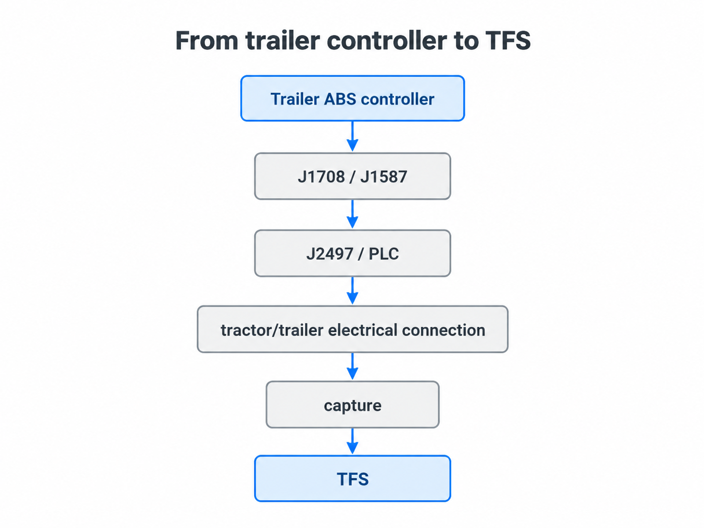

# How does a trailer message get to TFS?

A trailer controller has information, but it does not send that information directly into TFS.

There are several layers between a controller and the bytes TFS inspects.



*Simplified orientation only. The sections below separate J1587 meaning, J1708 message transport, J2497/PLC, and TFS's post-demodulation input boundary.*


## 1. The controller

A trailer electronic controller may have information about itself or the system it manages.

For example, a trailer-brake controller may expose software or component information.

## 2. J1587: what the message means

J1587 defines meanings and layouts for parameters carried in these messages.

This is where concepts such as MIDs and PIDs become meaningful.

## 3. J1708: the message transport

J1708 is the message transport used here. It carries the source MID and message data.

TFS must know the logger's framing convention before treating captured bytes as complete J1708/J1587 messages.

## 4. J2497 / PLC: the power-line path

On the tractor/trailer connection, J2497 can carry J1708/J1587 communication using power-line communication (PLC).

That lets communication travel over the existing electrical connection.

## 5. Capture and demodulation

A compatible interface can listen to the PLC traffic and recover J1708 message bytes.

**Current TFS boundary:** TFS starts *after* J2497 demodulation. TFS does not currently decode the PLC waveform itself.

## 6. TFS

TFS can inspect supported J1708/J1587 records, preserve some unsupported evidence, and decode a deliberately limited set of parameters.

It does not assume that every captured record is identity evidence.

## In short

```text
controller
   ↓
J1587 meaning
   ↓
J1708 message transport
   ↓
J2497 / PLC
   ↓
capture + demodulation
   ↓
TFS inspection
```

This is one communication path TFS is investigating. Other protocol families may exist on real equipment; native J1939/CAN ingestion is not currently implemented.

**Next:** [Who is talking, and what are they saying?](WHO_IS_TALKING.md)
