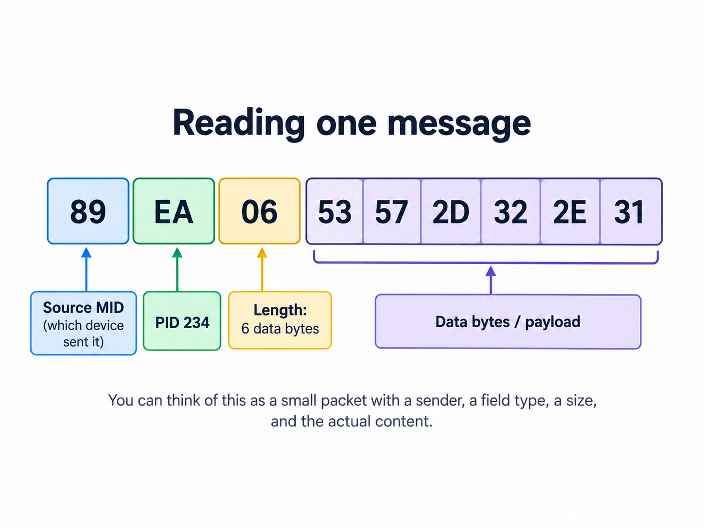

# Reading one message

Let's take a closer look at the same illustrative TFS test fixture:

```text
89 EA 06 53 57 2D 32 2E 31
```



*Verified against TFS's synthetic PID 234 regression fixture. This is not an authentic trailer capture.*

The easiest way to begin is with the meaning, not the protocol vocabulary.

| Part | Plain-English question | This example |
| --- | --- | --- |
| `89` | Who sent it? | Trailer Brakes #1 |
| `EA` | What information is this? | Software identification |
| `06` | How much data follows? | Six bytes |
| `53 57 2D 32 2E 31` | What is the value? | `SW-2.1` |


## 1. Who sent it?

`89` is hexadecimal. In decimal it is `137`.

In the source position of this message, that means:

> **Trailer Brakes #1**

The protocol term for this identifier is **MID**, or Message Identifier.

So:

```text
89 hex = 137 decimal = MID 137 = Trailer Brakes #1
```

## 2. What information is being reported?

`EA` is hexadecimal for decimal `234`.

PID 234 is **Software Identification**.

The protocol term **PID** means Parameter Identifier.

So:

```text
EA hex = 234 decimal = PID 234 = Software Identification
```

## 3. How much data follows?

`06` tells us that six data bytes follow.

## 4. What is the value?

Those six bytes are:

```text
53 57 2D 32 2E 31
```

Interpreted as ASCII text, they read:

```text
SW-2.1
```

## Putting it together

The complete fixture says:

> **Trailer Brakes #1 reported software-identification data with the value `SW-2.1`.**

That is a controller observation.

It is **not**, by itself, physical-trailer identity.

> **Fixture note:** `SW-2.1` is synthetic test data used by TFS. It is not claimed to be an authentic trailer capture.

**Next:** [How does a trailer message get to TFS?](HOW_A_MESSAGE_GETS_TO_TFS.md)
