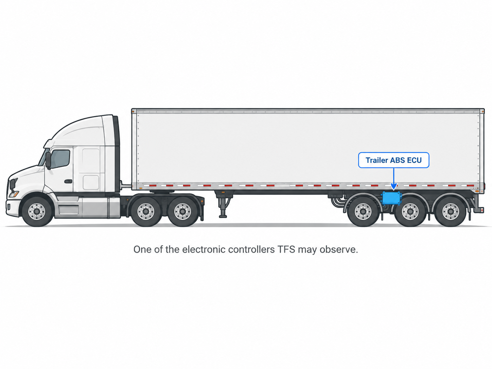

# WTFiS Trailer Fingerprint Software?

Fair question.

Trailer Fingerprint Software (TFS) is an open-source research project asking whether a trailer can be recognized from information its electronics already expose — without asking a driver to scan a VIN, type a unit number, or take a photo.

> **Can a trailer identify itself using information it already exposes?**



*Example physical context only. Controller placement varies by trailer and system.*

Modern heavy-duty trailers can contain electronic controllers for systems such as ABS and tire-pressure monitoring. Some of those controllers can communicate over the existing electrical connection between the tractor and trailer.

TFS listens for useful observations in that existing traffic.


## What is the trailer already telling us?

A controller may report information about itself, such as software identification or component identification. Other observations may include an electronically reported VIN or non-identity telemetry.

A J1587 message can look like this:

```text
89 EA 06 53 57 2D 32 2E 31
```

At first glance, that is just a row of numbers.

It is not.

In this **illustrative TFS test fixture**, the message can be read as:

> A trailer-brake controller reported software-identification data with the value `SW-2.1`.

That does **not** mean TFS has identified the physical trailer. A controller can be replaced, moved, or reprogrammed, and one observation does not tell the whole story.

TFS keeps those ideas separate on purpose.

> **TFS rule:** Show what the evidence supports. Stop where it does not.

**Next:** [What do these bytes mean?](READING_ONE_MESSAGE.md)
